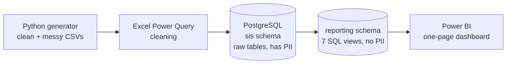

# LearnLens
 
A student outcomes dashboard that shows how each cohort is doing and flags students who might need support early.
 
LearnLens dashboard | PowerBI file is attached here - learnlens\dashboard


---
 
## The problem
 
Learning programs collect a lot of student data (enrollments, attendance, grades, surveys), but it usually sits in exports and spreadsheets. Staff end up checking things manually, and by the time someone notices a student is struggling, it's often too late to help.
 
Program teams need a quick way to answer:
 
- How is each cohort doing?
- Where is attendance dropping?
- Who is withdrawing?
- Which students need a check-in this week?
## What LearnLens does
 
LearnLens takes PowerSchool-style student records, cleans them, stores them in a proper database, and turns them into one simple dashboard.
 
- **214 students, 12 cohorts, 6 programs**
- **KPIs at a glance:** total students, cohorts, attendance %, withdrawal %, at-risk count
- **Cohort views:** enrolled vs withdrawn, average attendance by cohort (lowest first)
- **At-risk list:** students flagged for low attendance or a failing average, with the reason shown
- **Filters:** by Program and by Cohort, the whole page updates
## Tech stack
 
| Layer | Tool |
|---|---|
| Data generation | Python |
| Cleaning | Excel (Power Query) |
| Database | PostgreSQL 18 |
| Modeling | SQL views |
| Dashboard | Power BI |
| Version control | Git + GitHub |
 
## Architecture
 

 
Two schemas keep things safe:
 
- **`sis`**: raw tables (students, cohorts, enrollments, attendance, grades, surveys). Contains names and dates of birth.
- **`reporting`**: views that Power BI reads from. No names, no DOB, only student IDs. The dashboard never touches PII.
### Reporting views
 
| View | What it gives |
|---|---|
| `vw_enrollment_metrics` | Enrolled and withdrawn counts per cohort |
| `vw_cohort_retention` | Retention / withdrawal rate per cohort |
| `vw_cohort_attendance` | Average attendance % per cohort |
| `vw_at_risk_students` | Flagged students with risk level and reason |
| `vw_grades_by_cohort` | Average scores by cohort and course |
| `vw_survey_summary` | Survey satisfaction summary |
| `vw_attendance_vs_ct_benchmark` | Attendance compared to CT statewide chronic absence (not on the dashboard yet) |
 
## Repo structure
 
```
learnlens/
├── data/        # generated CSVs (clean + messy)
├── scripts/     # generate_data.py
├── excel/       # Power Query cleaning workbook
├── sql/         # schema.sql, views.sql
├── dashboard/   # learnlens.pbix
└── docs/        # data dictionary, cleaning log, privacy note, screenshots
```
 
## How to run it
 
**Just want to look?** Open `dashboard/learnlens.pbix` in Power BI Desktop. The data is saved inside the file.
 
**Want to rebuild it end to end:**
 
1. Generate the data
```bash
   python scripts/generate_data.py
```
2. Create the database (PostgreSQL, port 5433)
```sql
   CREATE DATABASE learnlens;
```
3. Build the tables
```bash
   psql -U postgres -p 5433 -d learnlens -f sql/schema.sql
```
4. Load the cleaned CSVs from `data/` into the `sis` tables (pgAdmin import or `\copy`)
5. Create the reporting views
```bash
   psql -U postgres -p 5433 -d learnlens -f sql/views.sql
```
6. Open `dashboard/learnlens.pbix` → Transform data → Data source settings → point it to your local Postgres → Refresh
## Design decisions
 
- **One page only.** Everything a program lead needs fits on one screen, no clicking around.
- **Attendance axis starts at 70, sorted worst first.** Most cohorts sit between 80 and 96%, so starting at 0 would hide the differences.
- **Teal for normal stats, orange for "watch these".** Withdrawal and at-risk numbers stand out on purpose.
- **Power BI reads only from `reporting` views.** Keeps PII out of the dashboard layer.
- **Cut for now:** CT benchmark chart and survey chart, to keep the page clean. Both views are ready in SQL.
## Privacy
 
All records are synthetic. The project still follows FERPA-style practices: PII stays in the `sis` schema, reporting views expose only IDs and aggregates. More in `docs/ferpa_privacy_note.md`.
 
## What's next
 
- Add the CT chronic absence benchmark as a second page
- Survey satisfaction view
- Scheduled refresh with a live data source
---
 
Built by Yogananda
